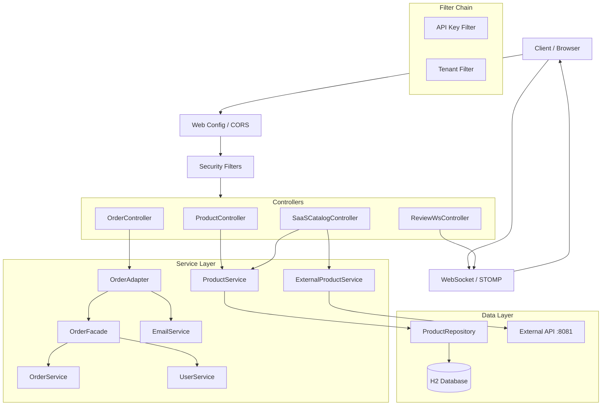

# Distributed Application Demo

## Overview
This is a Spring Boot application demonstrating a distributed application architecture for an e-commerce platform. It includes features for product management, shopping carts, order processing, user management, and multi-tenant SaaS capabilities.

The application serves both a monolithic web interface (using Thymeleaf) and RESTful APIs for potential microservices integration.

## Technologies
- **Java**: 17
- **Framework**: Spring Boot 3.5.6
- **Database**: H2 (In-Memory/File-based)
- **Templating**: Thymeleaf
- **Build Tool**: Maven
- **Real-time**: WebSocket (STOMP)

## System Architecture



## Setup and Installation

1.  **Clone the repository**
2.  **Build the project**:
    ```bash
    ./mvnw clean install
    ```
3.  **Run the application**:
    ```bash
    ./mvnw spring-boot:run
    ```
4.  **Access the application**:
    - Web UI: [http://localhost:8080](http://localhost:8080)
    - H2 Console: [http://localhost:8080/h2](http://localhost:8080/h2) (User: `sa`, Password: ``)
    - Swagger UI (if enabled): [http://localhost:8080/swagger-ui.html](http://localhost:8080/swagger-ui.html)

## Security & Multi-tenancy

The application implements custom security filters for API protection and multi-tenant isolation.

### Filters
1.  **ApiKeyFilter**: Protects `/saas/**` and `/api/**` endpoints.
    - Requires header: `X-API-KEY`
    - Value configured in `application.properties` (`app.saas.apikey`).
2.  **TenantFilter**: Enforces tenant access control for `/saas/**` and `/api/**`.
    - Requires header: `X-TENANT-ID`
    - Validates against allowed tenants list (`allowed.tenants`).

## Real-time Features (WebSockets)

The application supports real-time updates for product reviews using STOMP over SockJS.
- **Endpoint**: `/review-websocket`
- **Topic**: `/topic/reviews`
- **Prefix**: `/shop`
- **Flow**: Clients subscribe to `/topic/reviews` to receive new reviews instantly when pushed to `/shop/review`.

## Service Logic & Patterns

### Order Processing
The order flow demonstrates the **Facade** and **Adapter** patterns:
1.  **OrderController**: Receives checkout request.
2.  **OrderAdapter**: Wraps the facade and adds notification logic.
    - Calls `OrderFacade.finalizeOrder()`.
    - Calls `EmailService.sendEMail()` using the user ID from the order.
3.  **OrderFacade**: Simplifying interface that coordinates:
    - `UserService` to get the current user.
    - `OrderService` to create the order entity.

### External Integration
The `SaaSCatalogController` aggregates data from local and external sources:
- **Local**: `ProductService` fetches data from H2.
- **External**: `ExternalProductService` uses `RestTemplate` to fetch products from `http://localhost:8081/api/catalog`.
- **Resilience**: If the external service is down, it catches the exception and returns an empty list to avoid breaking the UI.

## Seed Data
On startup, the application pre-loads 10 sample products into the database (e.g., "XYZ" - Silver, "ABC" - Black, etc.). This logic is handled in `com.example.demo.LoadProductDatabase`.

## Configuration
The application is configured via `src/main/resources/application.properties`.

### Database
The project uses an H2 database storing data in a local file:
```properties
spring.datasource.url=jdbc:h2:file:./spring-boot-h2-db
spring.datasource.username=sa
spring.datasource.password=
```

### SaaS / Multi-tenancy
The application supports multi-tenancy configuration:
```properties
app.saas.apikey=MY_SECRET_KEY_123
allowed.tenants=shop-123,shop-abc
tenant.mapping.shop-123=sale
tenant.mapping.shop-abc=standard
```

## Development Tools

### CORS Configuration
Cross-Origin Resource Sharing is configured in `WebConfig.java` to allow requests from `http://localhost:5173` (typical Vite/React dev server) for both `/api/**` and `/saas/**` endpoints.

### H2 Console
Accessible at `/h2`. Ensure the JDBC URL matches the one in `application.properties`.

## Data Models

### Product
- **id**: Integer (Primary Key)
- **name**: String
- **price**: BigDecimal
- **size**: float
- **color**: String
- **category**: Enum (STANDARD, SALE)

### User
- **id**: int
- **firstname**: String
- **lastname**: String
- **email**: String
- **address**: Address Object (Street, City, State, Zip)

### Review
- **productId**: Integer
- **productName**: String
- **userName**: String
- **reviewText**: String
- **date**: String (YYYY-MM-DD HH:mm:ss)

## API Reference

### Product Management
| Method | Endpoint | Description |
| :--- | :--- | :--- |
| `GET` | `/products` | List all products (optional query param `?color=`) |
| `GET` | `/products/{id}` | Get product by ID |
| `GET` | `/products/category/{category}` | Get products by category |
| `POST` | `/products/add` | Add product (Form data) |
| `PUT` | `/products/updated` | Update an existing product |
| `DELETE` | `/products/delete/{id}` | Delete a product |

#### Add Product JSON Example
`POST /products/add-json`
```json
{
  "id": 11,
  "name": "New Phone",
  "price": 999.99,
  "size": 6.5,
  "color": "Gold",
  "category": "STANDARD"
}
```

### SaaS / Tenant Catalog
**Requires Headers**: `X-API-KEY`, `X-TENANT-ID`
| Method | Endpoint | Description |
| :--- | :--- | :--- |
| `GET` | `/saas/catalog` | Get combined catalog (Local + External) |
| `GET` | `/api/catalog` | Get products for specific tenant (Requires header `X-TENANT-ID`) |

### Users
| Method | Endpoint | Description |
| :--- | :--- | :--- |
| `GET` | `/user/users` | List all users |
| `GET` | `/user/{id}` | Get user by ID |
| `POST` | `/user/add` | Create a new user |

### Reviews and Orders
| Method | Endpoint | Description |Body Payload |
| :--- | :--- | :--- | :--- |
| `POST` | `/review` | Submit review | Form Data: `productId`, `productName`, `userName`, `reviewText` |
| `POST` | `/checkout` | Finalize order | Form Data: `totalPrice` |

## Frontend Overview
The application uses Thymeleaf templates located in `src/main/resources/templates`:
- **catalog.html**: Main product listing page.
- **catalog-paginated.html**: Paginated view of the catalog.
- **productDetail.html**: Detailed view of a single product, including reviews.
- **cart.html**: Shopping cart view.
- **order-success.html**: Order confirmation page.

## Testing
To run the automated tests:
```bash
./mvnw test
```
The test suite includes `DemoApplicationTests.java` which verifies context loading.

## Project Structure
- `com.example.demo`
    - `user`: User management domain.
    - `Product*`: Product catalog logic.
    - `Order*`: Order processing logic.
    - `ShoppingCart*`: Cart management.
    - `SaaSCatalogController`: Multi-tenant logic.
    - `*Config`: Spring configuration files.

## License
[MIT](LICENSE)
